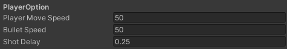

# TakeHomeWork2024_LEESUNJAE
## 환경 설정
    - Unity 2022.3.11f
    - Netcode for GameObject 1.6.0
    - Multiplayer Tools 1.1.1
## 소스 수정
    
  - Player Move Speed: 플레이어 이동 속도
  - Bullet Speed: 미사일 속도
  - Shot Delay: 미사일 발사 쿨타임 (1 = 1초당 1발)
  
## 빌드
  *  Host PC IP Address를 GameScene > NetworkManager > UnityTrasport > Address / port 값 변경 후 빌드
